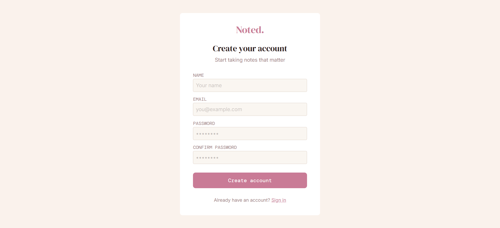
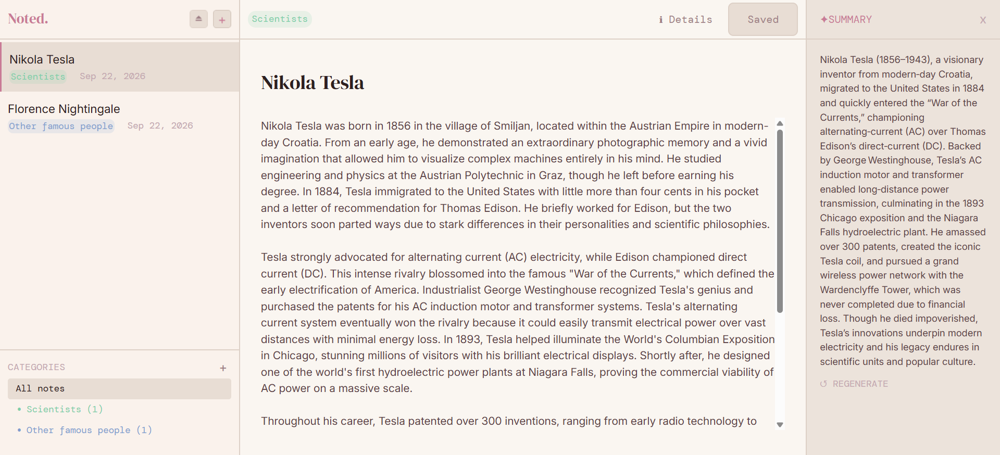

# Noted.
This full-stack application was created with the focus on backend development, while also implementing a frontend basis. The idea was to learn some new concepts, such as message queueing, AI API connections and database versioning, and use them in this sense.

## Tech Stack

**Backend:** Spring Boot, Maven, PostgreSQL, Liquibase (DB versioning), RabbitMQ (message queueing), Redis (rate limiting), Spring Security (JWT auth)

**Frontend:** React, TypeScript, TailwindCSS

**Infra:** Docker, Docker Compose

## Functionalities
- Register/Login options for users so they can access their private notes
- CRUD operations for the notes
- Use of categories for notes sorting, CRUD operation for categories
- Search function to find a note by keywords in its title or content
- AI summarization of notes, rate limiting per user to avoid abuse

## Implementation and concepts
The backend was programmed in Springboot with Maven, and the database was written in PostgreSQL.
The key concepts and their purpose are described in the following sections.
- ### Database versioning
Database versioning was implemented using Liquibase. Liquibase implements versioning via changelogs, files that contain the SQL code which describes what is being added to the database. This helps seperate the changes made to the database and allows a safe return to the previous development stage if needed. The changelog for these project can be seen in folder: backend/src/main/resources/db/changelog/changes.
- ### Authorization
Both access and refresh tokens were used, implemented with JWT. The access token is short-lived (15 minutes expiration) and sent with each request to verify the user's identity. The refresh token lives longer (7 days) and is used to get a new access token once it expires, so the user doesn't have to log in again constantly.

Passwords are hashed using Spring Security's PasswordEncoder (org.springframework.security.crypto.password) before being stored — never saved as plain text. On login, the entered password is hashed the same way and compared to the stored hash, rather than comparing raw passwords.
- ### Search
Implemented using Postgres full-text search ('tsvector', 'ts_query', 'ts_rank'). Added a new column in notes called search_vector containg ts_vectors for each note, making the search faster (no need to have a seperate query for every search).
- ### AI Summarization with an Async Job Pipeline using Message Queueing
To make the summarization faster, a message queue was implemented. The purpose was to prevent the backend from being blocked while waiting for response from the AI API. In that manner, the producer part of the backend sends each summarization job as a message to the consumer, which then calls the API and saves the result in the database directly. The frontend is then tasked with sending messages (every couple of seconds with a limit of messages) to see if the job has finished and getting the result. This was made possible by RabbitMQ library which covers the basics of message queueing.
- ### Rate limiting with Redis
Redis is a library that helps with the creations of tokens which are different for every user and contain the number of how many summarizations they had in a certain period of time. In this usecase, each key has an expiry set a day apart from the user's first summarization attempt. If the user reaches the limit of 5 summarizations (which are counted and saved in the token), they are prevented from using any more summarizations.
- ### Testing
Testing was done with SpringBootTest, after each crucial component of the app was integrated. Some of the examples of the tests are: note integration (testing the CRUD operations), search integration and rate limit test. All the tests are available in the backend/src/test/java/com/Noted/integration folder.

## Frontend

As previously said, frontend was developed more as a visual representation of the implemented backend features. Some features were left out, like search and the ability to see a note's summarization history. Frontend was implemented using React and Typescript, with TailwindCSS for styling.
  
### Frontend screenshots
  
  
  

## Setup
### Prerequisites
- Docker & Docker Compose
- Node.js (v18+) — for running the frontend separately
- An API key for the AI summarization service (e.g. OpenAI)

### Environment variables
Create a `.env` file in the `backend/` directory with:

POSTGRES_DB=  
POSTGRES_USER=  
POSTGRES_PASSWORD=  
RABBITMQ_DEFAULT_USER=  
RABBITMQ_DEFAULT_PASS=  
REDIS_PASSWORD=  
JWT_SECRET=  
AI_API_URL=  
AI_API_KEY=  
AI_API_MODEL=  


### Running the backend
The backend, database, RabbitMQ, and Redis are all containerized and can be started with a single command:
```bash
docker compose up
```
This will spin up:
- Spring Boot backend
- PostgreSQL database
- RabbitMQ (message broker)
- Redis (rate limiting)

### Running the frontend
```bash
cd frontend
npm install
npm run dev
```
The frontend will be available at `http://localhost:5173`.

## API Documentation
A Postman collection with all API endpoints is available at [`postman/Noted.postman_collection.json`](postman/Noted.postman_collection.json).

## Future Work

A few features were deliberately left out of v1 to keep scope manageable, along with some frontend gaps:

**Backend / Core features**
- Quiz generation (could reuse the existing async job pipeline with a different prompt and response schema)
- OAuth login (Google/GitHub)
- Real-time collaboration / note sharing between users
- Semantic/embedding-based search (as an upgrade to the current full-text search)
- Note versioning / edit history

**Frontend**
- Search functionality (implemented on the backend via Postgres full-text search, not yet wired up in the UI)
- Summarization history view (backend stores past summarizations, but there's no UI to browse them)
